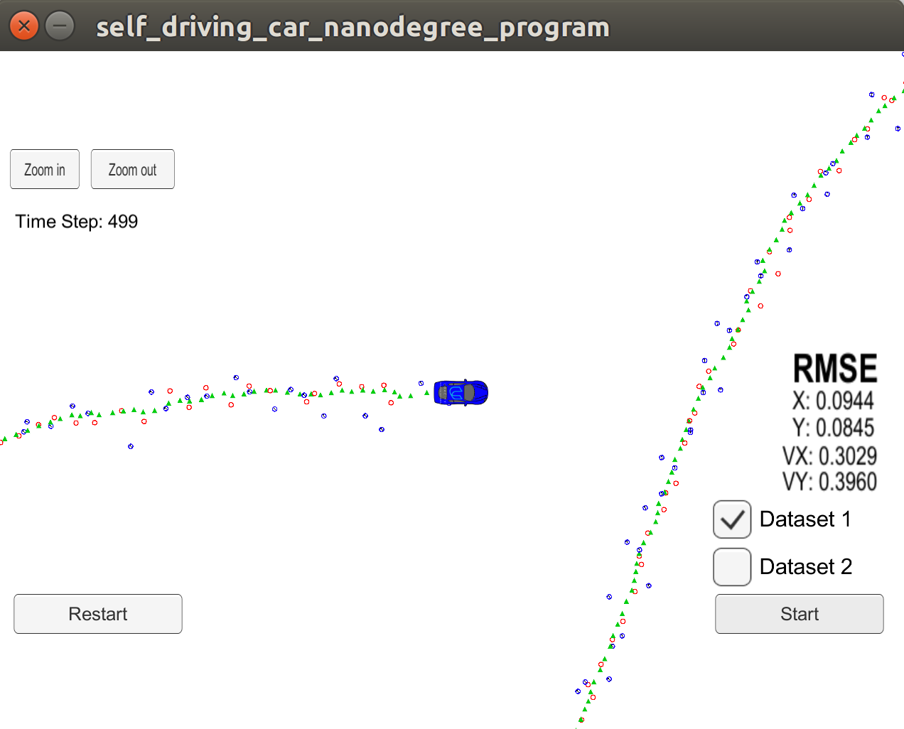

# Extended Kalman Filter Project 
 

The following project is a part of Udacity’s Self Driving car engineering NanoDegree program. The aim of project is to successfully implement Kalman filter in C++ on LIDAR and RADAR data to obtain a smooth curvature of the car in the simulator. 

Passing the project requires obtaining Root Mean Square Error values that are lower than the tolerance outlined in the project rubric. 

## The repository structure

| Name of Folder       | Contains                                |
| -------------------- | --------------------------------------- |
| /assets              | Resources for README                    |
| /cmake-build-release | Build files of the project              |
| /data                | LIDAR and RADAR data                    |
| /src                 | source file for the project in c++      |
| ./term2_sim.x86_64   | 64 bit version of the simulator         |
| term2_sim_Data       | unity data for simulator                |
| CMakeList.text       | Cmake list to build the project         |
| install-linux.sh     | setting up web sockets on Linux systems |

This project involves the Term 2 Simulator which can be downloaded [here](https://github.com/udacity/self-driving-car-sim/releases). Which is also included in the repository for Linux.

## Other Important Dependencies

- cmake >= 3.5
  - All OSes: [click here for installation instructions](https://cmake.org/install/)
- make >= 4.1 (Linux, Mac), 3.81 (Windows)
  - Linux: make is installed by default on most Linux distros
  - Mac: [install Xcode command line tools to get make](https://developer.apple.com/xcode/features/)
  - Windows: [Click here for installation instructions](http://gnuwin32.sourceforge.net/packages/make.htm)
- gcc/g++ >= 5.4
  - Linux: gcc / g++ is installed by default on most Linux distros
  - Mac: same deal as make - [install Xcode command line tools](https://developer.apple.com/xcode/features/)
  - Windows: recommend using [MinGW](http://www.mingw.org/)

## Basic Build Instructions

1. Clone this repo.
2. Use the install.sh scripts for installing uWebSocketIO  
3. Make a build directory: `mkdir build && cd build`
4. Compile: `cmake .. && make` 
   - On windows, you may need to run: `cmake .. -G "Unix Makefiles" && make`
5. Run it: `./ExtendedKF `

Here is the main protocol that main.cpp uses for uWebSocketIO in communicating with the simulator.

**INPUT**: values provided by the simulator to the c++ program

["sensor_measurement"] => the measurement that the simulator observed (either lidar or radar)

**OUTPUT**: values provided by the c++ program to the simulator

["estimate_x"] <= kalman filter estimated position x

["estimate_y"] <= kalman filter estimated position y

["rmse_x"]

["rmse_y"]

["rmse_vx"]

["rmse_vy"]

---

## [Rubric](<https://review.udacity.com/#!/rubrics/748/view>) Points

#### Here I will consider the rubric points individually and describe how I addressed each point in my implementation.  

------

### Writeup / README

#### 1. Provide a Writeup / README that includes all the rubric points and how you addressed each one.    

The given README.md file is an extensive writeup of the project. It includes the code folder architecture, resources, test output, Jupyter Notebook etc. For any questions, please contact 

Shivam Bhardwaj 

 [LinkedIn](<https://www.linkedin.com/in/shivamnyu/>) [Instagram](https://www.instagram.com/lazy.shivam/) [Facebook](<https://www.facebook.com/shivambhardwaj2008>) [Github](https://github.com/Shivam-Bhardwaj)

Mail to shivam.bhardwaj@nyu.edu

### Discussion

To begin with I would like to thank Udacity team for compiling everything in such an amazing tutorial. Following are my take on the overall project.

- When 

The code was tested on the following specifications

- **CPU:** `Intel(R) Core(TM) i9-8950HK CPU @ 4.8 Ghz`
- **GPU:** `Nvidia GeForce GTX 1050 Ti Mobile`
- **OS:** `Ubuntu 16.04.6 LTS (Xenial Xerus)` 
- **Kernal:** `4.15.0-48-generic`

